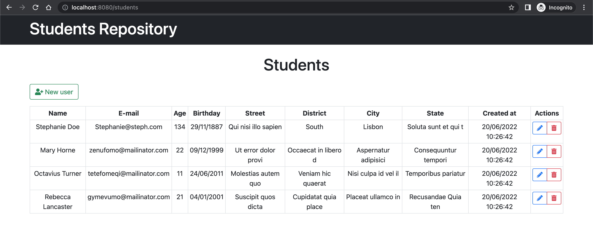

# Student Repository

## Getting Started

Original Tutorial: [Build a Full Stack Application Using Spring Boot and Thymeleaf](https://www.educative.io/collection/page/10370001/4620998892847104/6621589491941376/project) on [educative.io](https://www.educative.io)

Tech stacks: [Spring Boot](https://spring.io), [Thymeleaf](https://www.thymeleaf.org), [Bootstrap](https://getbootstrap.com), [jQuery](https://jquery.com)

Beyond the designated tasks, I've made some improvements in this project. Specifically, in the provided `students.html` template, the `delete` button did not work, so I fixed this bug.



### List of Tasks

- Task 1: Resource Allocation (src/main/resources/application.properties)
- Task 2: Adding data from a file (src/main/resources/application.properties)
- Task 3: Create Entities (src/main/java/com/example/thymeleaf/entity/Student.java)
- Task 4: Create Data Transfer Objects (src/main/java/com/example/thymeleaf/dto/CreateStudentDTO.java)
- Task 5: Implement Student Repository (src/main/java/com/example/thymeleaf/repository/StudentRepository.java)
- Task 6: Implement the Index Controller (src/main/java/com/example/thymeleaf/controller/IndexController.java)
- Task 7: Create Get Request Handle (src/main/java/com/example/thymeleaf/controller/StudentController.java)
- Task 8: Create Post Mapping (src/main/java/com/example/thymeleaf/controller/StudentController.java)
- Task 9: Implement Delete Student (src/main/java/com/example/thymeleaf/controller/StudentController.java)
- Task 10: Student Template (src/main/resources/templates/students.html)
- Task 11: Build the Spring Boot Application
- Task 12: Run the Spring Boot Application

### H2 In-memory Database

This project uses H2 in-memory database as we do not need to persist the data. By default, it is volatile and all stored data loss when we restart the application.

### Build the Spring Boot application

Make sure you are inside the `sprithyme` repository

```
cd /sprithyme
```

Verify the installation of Maven

```
mvn -v
```

Build your Spring Boot application

```
mvn clean install
```

### Run the Spring Boot Application

Now that your application is compiled, let’s run it with the following command

```
mvn spring-boot:run
```

Access the application at http://localhost:8080/students

Access the H2 database after you've run the application at http://localhost:8080/h2-console. Make sure to check the `application.properties` file for correct information asked when accessing the in-memory database.

### Stop the application

Terminate your current terminal to stop the application as well as free up the current port.

## Reference Documentation
For further reference, please consider the following sections:

* [Official Apache Maven documentation](https://maven.apache.org/guides/index.html)
* [Spring Boot Maven Plugin Reference Guide](https://docs.spring.io/spring-boot/docs/2.7.5/maven-plugin/reference/html/)
* [Create an OCI image](https://docs.spring.io/spring-boot/docs/2.7.5/maven-plugin/reference/html/#build-image)
* [Spring Web](https://docs.spring.io/spring-boot/docs/2.7.5/reference/htmlsingle/#web)
* [Thymeleaf](https://docs.spring.io/spring-boot/docs/2.7.5/reference/htmlsingle/#web.servlet.spring-mvc.template-engines)
* [Spring Boot DevTools](https://docs.spring.io/spring-boot/docs/2.7.5/reference/htmlsingle/#using.devtools)

## Guides
The following guides illustrate how to use some features concretely:

* [Building a RESTful Web Service](https://spring.io/guides/gs/rest-service/)
* [Serving Web Content with Spring MVC](https://spring.io/guides/gs/serving-web-content/)
* [Building REST services with Spring](https://spring.io/guides/tutorials/rest/)
* [Handling Form Submission](https://spring.io/guides/gs/handling-form-submission/)